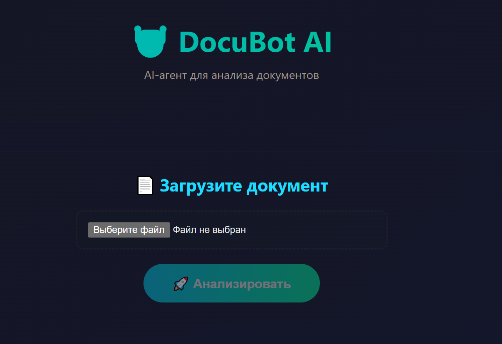
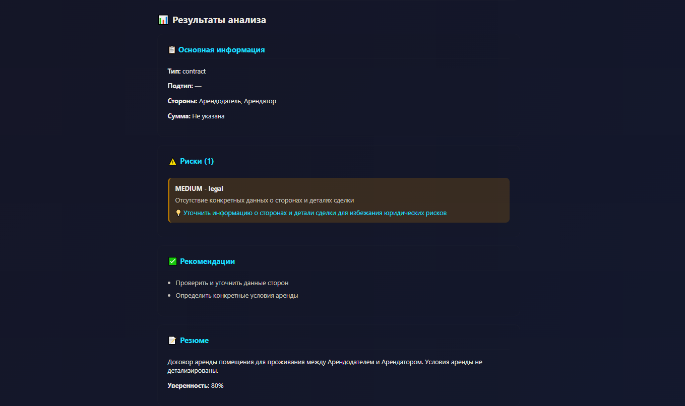
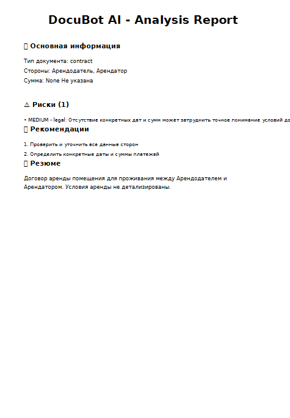

# 🤖 DocuBot AI

**AI-powered document analysis service**

[](https://python.org)
[](https://fastapi.tiangolo.com)
[](https://nextjs.org)
[](LICENSE)

---

## 📋 About

DocuBot AI is an intelligent service for analyzing legal documents (contracts, invoices, acts). 
Using Yandex GPT, it automatically extracts data, identifies risks, and generates recommendations.

### ✨ Features

- ✅ **PDF Analysis** in 5-10 seconds
- ✅ **Data Extraction**: parties, amounts, dates, obligations
- ✅ **Risk Detection**: financial, legal, operational
- ✅ **PDF Reports** with full analysis
- ✅ **Telegram Bot** for 24/7 access
- ✅ **Analysis History** in database
- ✅ **Smart Caching** for repeated documents

---

## 🌐 Live Demo

### Web Application
🔗 **Frontend**: https://docubot-three.vercel.app

### Telegram Bot
🤖 **@DocuBotAI_bot**: https://t.me/DocuBotAI_bot

### API Documentation
🔌 **Backend**: https://docubot-production-043f.up.railway.app/docs

---

## 📸 Screenshots

### Main Interface


### Analysis Results


### PDF Report


### Main Interface


### Analysis Results


### PDF Report


---

## 🛠️ Tech Stack

### Backend
- **Python 3.11**
- **FastAPI** — REST API
- **SQLAlchemy** — ORM
- **PostgreSQL/SQLite** — Database
- **Yandex GPT** — AI Analysis
- **ReportLab** — PDF Generation
- **PyPDF2** — PDF Parsing
- **PyJWT** — Authentication

### Frontend
- **Next.js 14** — React Framework
- **TypeScript** — Type Safety
- **Axios** — HTTP Client
- **Tailwind CSS** — Styling

### DevOps
- **Railway** — Backend Hosting
- **Vercel** — Frontend Hosting
- **Docker** — Containerization
- **GitHub Actions** — CI/CD

---

## 🚀 Quick Start

### Prerequisites
- Python 3.11+
- Node.js 18+
- Yandex Cloud account (for GPT API)

### Backend Setup

```bash
cd backend

# Create virtual environment
python -m venv venv
source venv/bin/activate  # Linux/Mac
.\venv\Scripts\Activate.ps1  # Windows

# Install dependencies
pip install -r requirements.txt

# Create .env file
cp .env.example .env

# Edit .env with your credentials
# - YANDEX_FOLDER_ID
# - AUTHORIZED_KEY_CONTENT (Yandex Cloud service account key)
# - DATABASE_URL (optional, defaults to SQLite)

# Run server
python main_simple.py