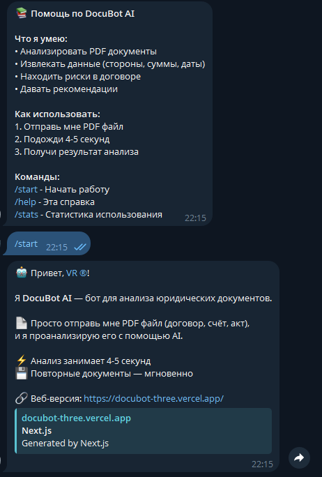

# 🤖 DocuBot AI

**AI-сервис для анализа юридических документов**

[](https://python.org)
[](https://fastapi.tiangolo.com)
[](https://nextjs.org)
[](https://postgresql.org)
[](LICENSE)

---

## 📋 Описание

DocuBot AI — это интеллектуальный сервис для анализа юридических документов (договоры, счета, акты). 
Используя Yandex GPT, система автоматически извлекает данные, находит риски и формирует рекомендации.

### ✨ Возможности

- ✅ **Анализ PDF документов** за 5-10 секунд
- ✅ **Извлечение данных**: стороны, суммы, даты, обязательства
- ✅ **Поиск рисков**: финансовые, юридические, операционные
- ✅ **PDF отчёты** с полным анализом
- ✅ **Telegram бот** для работы 24/7
- ✅ **История анализов** в базе данных
- ✅ **Кэширование** для повторных документов

---

## 🌐 Демо

### Веб-версия
🔗 **Frontend**: https://docubot-three.vercel.app

### Telegram бот
🤖 **@DocuBotAI_bot**: https://t.me/DocuBotAI_bot

### API
🔌 **Backend**: https://docubot-production-043f.up.railway.app

---

## 📸 Скриншоты

### Главная страница


### Результат анализа


### PDF отчёт


### Telegram бот


---

## 🛠️ Технологии

### Backend
- **Python 3.11**
- **FastAPI** — REST API
- **SQLAlchemy** — ORM
- **PostgreSQL** — база данных
- **Yandex GPT** — AI анализ
- **ReportLab** — генерация PDF
- **PyPDF2** — чтение PDF
- **PyJWT** — аутентификация

### Frontend
- **Next.js 14** — React фреймворк
- **TypeScript** — типизация
- **Axios** — HTTP запросы
- **html2pdf.js** — клиентская генерация PDF

### DevOps
- **Railway** — хостинг backend + bot
- **Vercel** — хостинг frontend
- **Docker** — контейнеризация
- **GitHub Actions** — CI/CD

---

## 🚀 Установка и запуск

### Требования
- Python 3.11+
- Node.js 18+
- PostgreSQL 15+
- Yandex Cloud аккаунт (для GPT API)

### 1. Клонируйте репозиторий

```bash
git clone https://github.com/wadim129-cyber/docubot.git
cd docubot